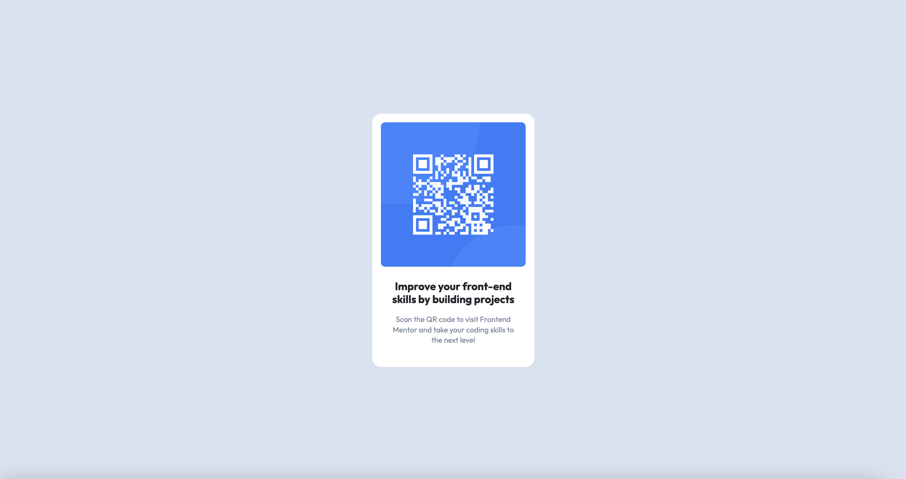

# Frontend Mentor - QR code component solution

This is a solution to the [QR code component challenge on Frontend Mentor](https://www.frontendmentor.io/challenges/qr-code-component-iux_sIO_H). Frontend Mentor challenges help you improve your coding skills by building realistic projects.

## Table of contents

- [Overview](#overview)
  - [Screenshot](#screenshot)
- [My process](#my-process)
  - [Built with](#built-with)
  - [What I learned](#what-i-learned)
  - [Continued development](#continued-development)
- [Author](#author)

## Overview

### Screenshot



## My process

This is a simple little element nested in the center of a page so I started off with creating the few HTML elements necessary to build it and giving them unique classnames.

I decided to go with flexbox because it's great for quickly centering content. I used a flexbox on the parent element of the entire white box, and also on the white box itself for centering the content inside.

Lastly, I styled the elements based of the mockup that was provided.

### Built with

- Semantic HTML5 markup
- CSS custom properties
- Flexbox

### What I learned

Things are so much easier to build quickly when a design team already plans out the colors, sizes, and layout. Executing is the easy part in my opinion.

I'm trying to remember to tell myself that it's okay to nest elements even further if it serves a purpose. Yes, it creates more work for me, but it condenses the CSS and prevents me from having to repeat myself in the stylesheet.

Also, I sometimes forget to save myself some time and energy by storing color values as variables, but I remembered to this time and it was nice being able to write out the color names rather than the color parameter numbers every single time.

```css
:root {
  --white: hsl(0, 0%, 100%);
  --light-grey: hsl(212, 45%, 89%);
  --greyish-blue: hsl(220, 15%, 55%);
  --dark-blue: hsl(218, 44%, 22%);
}
```

### Continued development

I used flexbox in this exercise like I always do becuase I'm comfortable with its functionality. However, I'd like to push myself to use a grid system next time (even if it isn't more practical than flexbox) just to familiarize myself with it a little more. I'm scared of it right now.

## Author

- GitHub - [@sherb93](https://github.com/sherb93)
